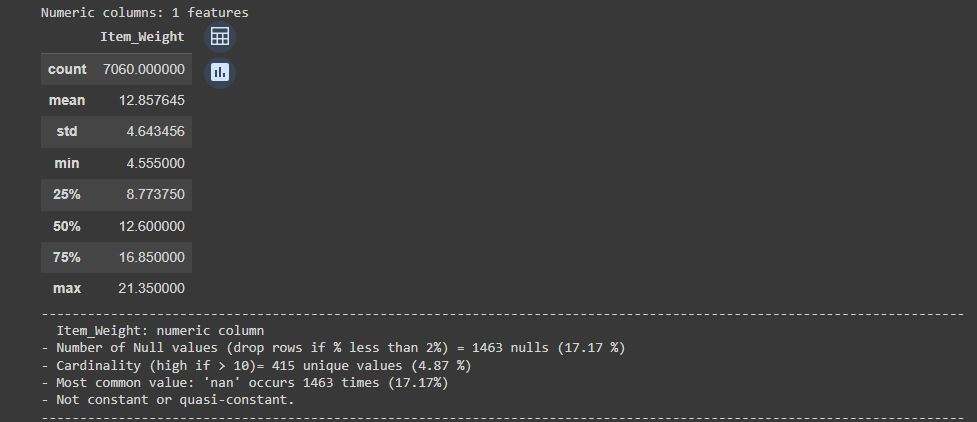
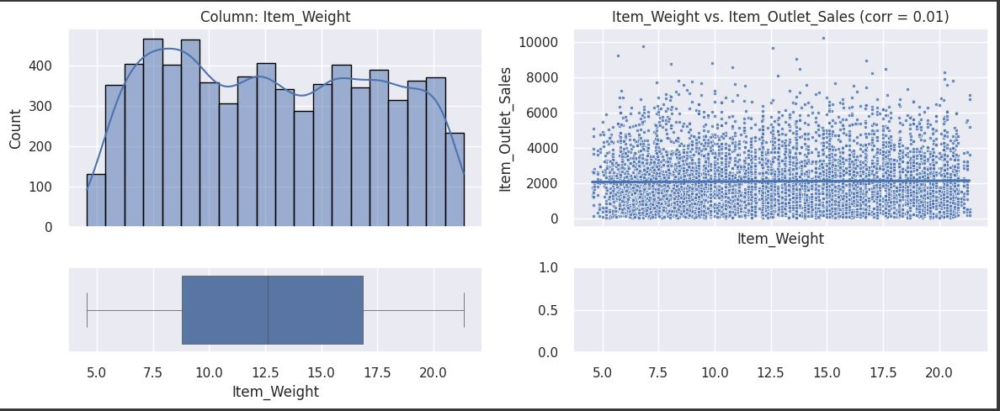

# Sales Predictions
## Analysis and predictions for food items sold at various stores 

**Author**: Ahmed Wassel Angar 

### Business problem:

The goal of this project is to help the retailor understand the properties of products and outlets that play crucial roles in increasing sales.

### Data:
[Data Source](https://drive.google.com/file/d/1pjfwuYRLDsei9Z8gYFtHhi-pEKxp8DAA/view)

For this dataset there are 8523 rows and 12 columns.
### Data Dictionary:
Variable  | Description
-------------------|------------------
Item_Identifier             | Unique product ID
Item_Weight                 | Weight of product
Item_Fat_Content            | Whether the product is low fat or regular
Item_Visibility             | The percentage of total display area of all products in a store allocated to the particular product
Item_Type                   | The category to which the product belongs
Item_MRP                    | Maximum Retail Price (list price) of the product
Outlet_Identifier           | Unique store ID
Outlet_Establishment_Year   | The year in which store was established
Outlet_Size                 | The size of the store in terms of ground area covered
Outlet_Location_Type        | The type of area in which the store is located
Outlet_Type                 | Whether the outlet is a grocery store or some sort of supermarket
Item_Outlet_Sales           | Sales of the product in the particular store. This is the target variable to be predicted.
---

## Exploratery Data Analysis
*Note: We will use a copy of df in our analysis. The original dataset will remain almost as it is for mdeling use afterwards.*

*Note: We did use custom functions (explore_structure(), explore_numeric_feature(), explore_categorical_feature(), plot_numeric() and plot_categorical()) to explore the dataset numerically and visually (univariate and multivariate visualizations).*
- First of all, we will use a custom function called explore(dataframe,data_dictionary) that will:
    - extract the features' datatypes from the data dictionary and address every data type within our dataset. Using a Try and Except, the       function will address every feature's datatype and throws a warning message if the column did not change its type successfully,
    - Check for duplicated row and drop them if found. A message with the number of deleted rows will be displayed for the user.
    - diplay a missingso graph to evalute missing values: rows with missing values from each feature that count for less than the threshold (% of the entire dataset lenght) will be automatically dropped. A message will signal this to the user. The default value of the threshold is 0%.
    - Check for rows that have missing values across all features. These rows (obsolete) will be deleted. A message with the number of deleted rows will be displayed for the user,
    - display a numerical desciption for each feature (min, max, mean, 25% quantile, 75% Quantile, standard deviation and the count). We         will use these ao assess any inconsistency within our numerical features,
    - Display the name of each feature:
        - its nature (numerical or categorical), the count of missing values as well as its percentage,
        - its cardinality and the corresponding percentage,
        - The unique values within each categorical feature, the count of each unique value and its percentgae to check the feature's                consistancy.
        - the most common value and its number of occurences as well as a warning message if the corresponding feature is constant or                quasi-constant (>=98% of occurences for the most common value),
- Obsevations :
    - All features changed their types succefully,
    - Item_Identifier have a very high cardinality and is not a unique identifier of a row. **We will drop this column** from our model later on.
    - There are no duplicated rows,
    - No rows has been dropped relatively to a threshold of 2%,
    - There is no inconsistencey within the numerical features,
    - Two features have missing values, which are "Item_Weight" and "Outlet_Size":
        - Part of the outlets with missing size corresspond to the grocery stores. Hence, we will suppose that all grocery stores are small sized.
        - The remaining outlets with missing size corresspond are OUT007 and OUT045. Both of them are Supermarkets of Type 1 located in Tier2. The only outlet with same characteristics is OUT035, which is a small sized outlet and have a greater average sales than the former two. Hence, we will assume that OUT007 and OUT045 are small sized.
        - For "Item_Weight"'s missing values, we will impute the missing values by the average weights of the corresponding "Item_Type" subset.
    - The "Item_Weight" feature is equally distributed and has a correlation of almost 0 (corr = 0.01) with our target "Item_Outlet_Sales". Plus from a business point of view it is unlikely that it affects our target. => Therefor, **we will drop it**.
      
      
    - The "Outlet_Establishment_Year" feature seems to have no influence on the target which is almost constant across all years (except of two) and a correlation of almost 0 (corr = -0.05). Plus, from a business point of view, the stackeholders can not affect or change the Outlet Establishment Year. => Therefor, **We will drop it**. 
  

## Results

### Here are examples of how to embed images from your sub-folder

#### Visual 1 Title

> Sentence about visualization.

#### Visual 2 Title

## Model

Describe your final model

Report the most important metrics

Refer to the metrics to describe how well the model would solve the business problem

## Recommendations:

More of your own text here

## Limitations & Next Steps

More of your own text here

### For further information

For any additional questions, please contact **email**
